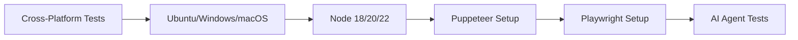
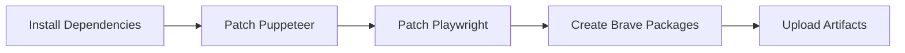
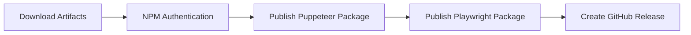

# 🚀 **GitHub Actions NPM Publishing Setup**

## 📋 **Overview**

आपका GitHub Actions workflow पहले से ही **completely configured** है और **GH_TOKEN + NPM_TOKEN** के साथ automatic NPM publishing करने के लिए तैयार है!

## 🔐 **Required Secrets Configuration**

### **Step 1: GitHub Repository Secrets**
आपको अपने GitHub repository में ये secrets add करने होंगे:

| Secret Name | Required | Purpose | How to Get |
|-------------|----------|---------|------------|
| `NPM_TOKEN` | ✅ **REQUIRED** | NPM पर packages publish करने के लिए | [NPM Token Guide](#npm-token-setup) |
| `GH_TOKEN` | ✅ **RECOMMENDED** | Enhanced GitHub permissions के लिए | [GitHub Token Guide](#github-token-setup) |

---

## 📦 **NPM Token Setup**

### **1. NPM Account Login**
```bash
# NPM में login करें
npm login
```

### **2. Create NPM Token**
1. 🌐 **NPM Website**: [npmjs.com](https://www.npmjs.com) पर login करें
2. 🔧 **Profile Settings**: Profile → Access Tokens
3. ➕ **Generate Token**: "Generate New Token" पर click करें
4. 🎯 **Token Type**: "Automation" या "Publish" select करें
5. 📋 **Copy Token**: Generated token को safely copy करें

### **3. Add to GitHub Secrets**
1. 🏗️ **Repository Settings**: GitHub repository → Settings → Secrets and variables → Actions
2. ➕ **New Secret**: "New repository secret" click करें
3. 📝 **Secret Name**: `NPM_TOKEN`
4. 🔐 **Secret Value**: आपका NPM token paste करें
5. ✅ **Save**: "Add secret" पर click करें

---

## 🔑 **GitHub Token Setup**

### **1. Create Personal Access Token**
1. 🔧 **GitHub Settings**: Profile → Settings → Developer settings
2. 🔑 **Personal Access Tokens**: Tokens (classic) या Fine-grained tokens
3. ➕ **Generate New**: "Generate new token" पर click करें
4. 🏷️ **Token Name**: "Rebrowser-Patches-CI" (या कोई meaningful name)
5. 📅 **Expiration**: 90 days या No expiration (recommended)

### **2. Required Permissions**
Select करें:
- ✅ `repo` (Full control of repositories)
- ✅ `packages:write` (Upload packages to GitHub Package Registry)
- ✅ `contents:write` (Repository contents read and write)
- ✅ `metadata:read` (Repository metadata read)

### **3. Add to GitHub Secrets**
1. 📋 **Copy Token**: Generated token को copy करें
2. 🏗️ **Repository Settings**: Settings → Secrets and variables → Actions
3. ➕ **New Secret**: `GH_TOKEN` name से add करें

---

## 🎯 **Workflow Triggers**

आपका workflow **automatically trigger** होगा:

### **1. Automatic Triggers** ⚡
```yaml
# Push to main/master branch
git push origin main

# Create and push version tags
git tag v1.0.0
git push origin v1.0.0

# GitHub Releases
# Release page से new release बनाने पर
```

### **2. Manual Triggers** 🎮
```bash
# GitHub repository → Actions → "🚀 Build & Publish NPM Packages"
# → "Run workflow" → Select options → "Run workflow"
```

**Manual Options Available:**
- 📊 **Publish Type**: patch, minor, major, prerelease
- 🧪 **Dry Run**: Test without actual publishing
- 🎯 **Target Branch**: Select branch to run from

---

## 📊 **Workflow Process**

### **Phase 1: Testing** 🧪


### **Phase 2: Building** 🔨


### **Phase 3: Publishing** 🚀


---

## 📦 **Published Packages**

Workflow successful होने पर ये packages NPM पर publish होंगे:

| Package Name | Description | NPM Link |
|--------------|-------------|----------|
| `brave-puppeteer-core` | 🎭 Puppeteer with integrated stealth patches | [View on NPM](https://npmjs.com/package/brave-puppeteer-core) |
| `brave-playwright-core` | 🎪 Playwright with integrated stealth patches | [View on NPM](https://npmjs.com/package/brave-playwright-core) |

---

## 🔍 **Monitoring & Logs**

### **1. Workflow Status**
- 📊 **GitHub Actions Tab**: Repository → Actions
- 🔄 **Real-time Logs**: Click on any running workflow
- 📈 **Success/Failure Status**: Green ✅ या Red ❌ indicators

### **2. Log Categories**
| Stage | What to Check | Success Indicators |
|-------|--------------|-------------------|
| 🧪 **Testing** | Cross-platform compatibility | ✅ All OS + Node versions pass |
| 🔨 **Building** | Patch application & package creation | ✅ Artifacts uploaded successfully |
| 🚀 **Publishing** | NPM authentication & upload | ✅ "Successfully published to NPM" |
| 🏷️ **Release** | GitHub release creation | ✅ New release appears |

---

## 🐛 **Troubleshooting**

### **Common Issues & Solutions:**

#### **1. NPM Authentication Failed** ❌
```bash
Error: 401 Unauthorized
```
**Solution:**
- ✅ NPM_TOKEN correct है या नहीं check करें
- ✅ Token की permissions verify करें
- ✅ Token expired नहीं है न?

#### **2. GitHub Release Failed** ❌
```bash
Error: Bad credentials
```
**Solution:**
- ✅ GH_TOKEN permissions check करें
- ✅ `contents:write` permission available है?
- ✅ Token expire तो नहीं हो गया?

#### **3. Package Already Exists** ⚠️
```bash
Error: You cannot publish over the previously published versions
```
**Solution:**
- 📊 **Version Bump**: package.json में version बढ़ाएं
- 🔄 **Automatic Versioning**: Workflow input में version type select करें

#### **4. Build Failures** 🔨
```bash
Error: Patch application failed
```
**Solution:**
- ✅ Dependencies properly installed हैं?
- ✅ Target packages (puppeteer-core/playwright-core) available हैं?
- ✅ Patch files malformed तो नहीं?

---

## 🎯 **Quick Start Commands**

### **1. Setup Repository**
```bash
# Clone your repository
git clone https://github.com/yourusername/rebrowser-patches.git
cd rebrowser-patches

# Add secrets via GitHub web interface
# NPM_TOKEN और GH_TOKEN add करें
```

### **2. Trigger Publishing**
```bash
# Method 1: Push to main
git add .
git commit -m "🚀 Ready for NPM publishing"
git push origin main

# Method 2: Create release tag  
git tag v1.0.0
git push origin v1.0.0

# Method 3: Manual trigger via GitHub Actions UI
```

### **3. Verify Success**
```bash
# Check NPM packages
npm search brave-puppeteer-core
npm search brave-playwright-core

# Install and test
npm install brave-puppeteer-core
npm install brave-playwright-core
```

---

## 🎉 **Success Indicators**

आपको पता चल जाएगा कि everything successful रहा अगर:

1. ✅ **GitHub Actions**: सभी jobs green status में हैं
2. ✅ **NPM Packages**: दोनों packages NPM पर दिख रहे हैं
3. ✅ **GitHub Release**: New release created हो गया है
4. ✅ **Installation**: `npm install` command काम कर रही है

---

## 📞 **Support**

अगर कोई issue आए तो:

1. 📊 **Check Logs**: GitHub Actions logs में detailed errors देखें
2. 🔍 **Verify Secrets**: NPM_TOKEN और GH_TOKEN properly set हैं?
3. 📋 **Dependencies**: सभी required packages installed हैं?
4. 🎯 **Permissions**: Repository और token permissions adequate हैं?

---

## 🎊 **Final Status**

```
🎯 Workflow Configuration: ✅ COMPLETE
🔐 Secrets Required: NPM_TOKEN + GH_TOKEN  
🚀 Auto Publishing: ✅ ENABLED
🎭 Package Support: Puppeteer + Playwright
📦 NPM Deployment: ✅ READY
🏷️ GitHub Releases: ✅ AUTOMATED
```

**आपका complete CI/CD pipeline ready है! 🚀**
